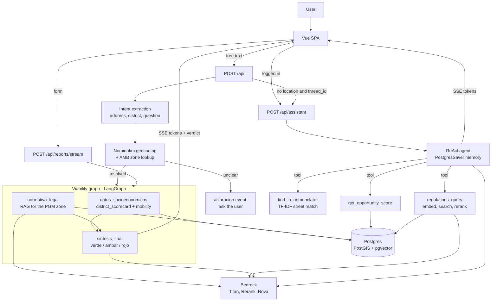

# Architecture diagram

How a request flows through the system. The report pipeline fans out into data and legal branches (run in parallel) and fans in at the synthesis step.

```mermaid
graph TD
    U[User] --> FE[Vue SPA]
    FE -->|form| REP[POST /api/reports/stream]
    FE -->|free text| CHAT[POST /api]
    FE -->|logged in| AST[POST /api/assistant]

    CHAT --> NLU[Intent extraction<br/>address, district, question]
    NLU --> GEO[Nominatim geocoding<br/>+ AMB zone lookup]
    GEO -->|unclear| ASK[aclaracion event:<br/>ask the user]
    GEO -->|resolved| REP2[Viability graph]
    CHAT -->|no location and thread_id| AST
    REP --> REP2

    subgraph REP2[Viability graph - LangGraph]
        direction LR
        D[datos_socioeconomicos<br/>district_scorecard + mobility]
        N[normativa_legal<br/>RAG for the PGM zone]
        D --> S[sintesis_final<br/>verde / ambar / rojo]
        N --> S
    end

    AST --> RA[ReAct agent<br/>PostgresSaver memory]
    RA -->|tool| FN[find_in_nomenclator<br/>TF-IDF street match]
    RA -->|tool| OS[get_opportunity_score]
    RA -->|tool| RQ[regulations_query<br/>embed, search, rerank]

    D --> PG[(Postgres<br/>PostGIS + pgvector)]
    N --> PG
    OS --> PG
    RQ --> PG
    N --> BR[Bedrock<br/>Titan, Rerank, Nova]
    RQ --> BR
    S --> BR
    RA --> BR

    S -->|SSE tokens + verdict| FE
    RA -->|SSE tokens| FE
```
